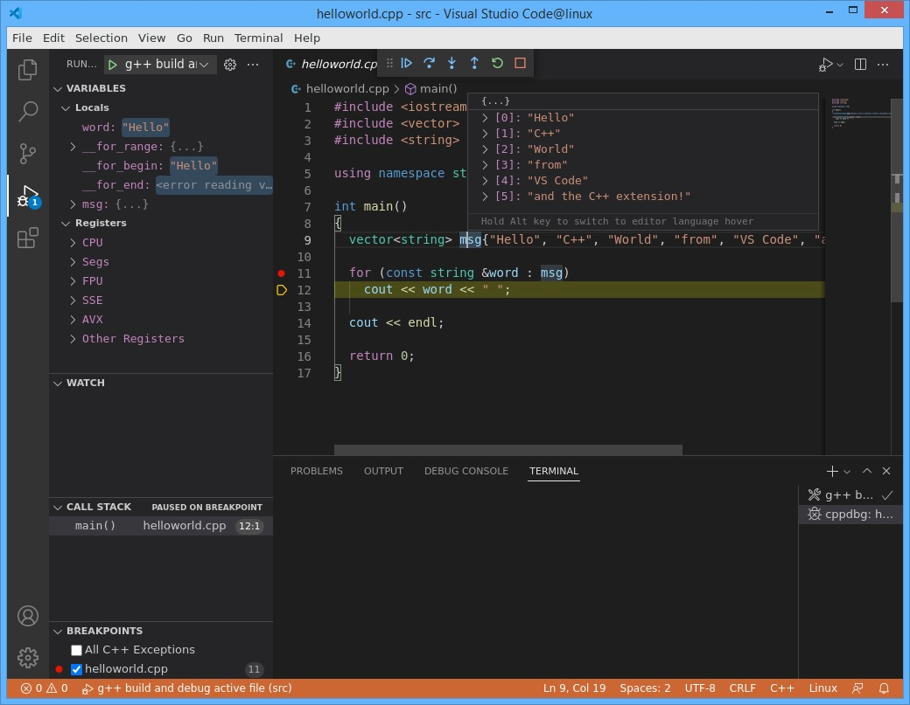

# code-con
> A Docker container image for [MS Visual Studio Code](https://code.visualstudio.com/) and [CDR code-server](https://github.com/coder/code-server).

## Motivation

|     App     |           Pros           |                                           Cons                                                                             |
|:-----------:|:------------------------:|:--------------------------------------------------------------------------------------------------------------------------:|
|   VS Code   | Full IDE with extensions |                                       Desktop app                                                                          |
| code-server |          Web app         | Installing MS extensions violates Term-of-Use ([ToU](https://marketplace.visualstudio.com/items/ms-vscode.cpptools/license)) |

## Uses

- Headless server: run app with X in a remote server.
- Reproducible science: pack all tools and data needed for a experiment along with the IDE in order to re-run it or do a step-by-step execution.
- Edit, compile and run any source code with just attaching the folder to a Docker volume.
- Distribute a full IDE version with all components (compiler, debugger, extensiones, etc) already installed.
- Change some packages installed in this image in order to switch to other languages (Python, R, Javascript, etc).
- In Windows, you may want to run, test or debug your app against Linux libraries without using WSL.

> **Word of caution**: this image is intended as a Proof-of-Concept (PoC) for educational purposes only.

## Prerequisites

- Docker
- Windows: install [MobaXterm](https://mobaxterm.mobatek.net/download.html) to run the X11 server
- Mac: install [XQuartz](https://www.xquartz.org)
- Terminal: you may use [MobaXterm](https://mobaxterm.mobatek.net/download.html) or any other app

## Software and versions

As of April 2022, the image comes with the following software installed:

| Software apps or packages                                  | Version                                                                         |
|:----------------------------------------------------------:|:--------------------------------------------------------------------------------|
| VS Code                                                    |        [1.66](https://github.com/microsoft/vscode/releases/tag/1.66.0)          |
| code-server                                                |       [4.2.0](https://github.com/coder/code-server/releases/tag/v4.2.0)         |
| `build-essential` (`gcc`, `g++`, `make`)                   |                                   12.4                                          |
| C/C++ IntelliSense, debugging, and code browsing extension | [1.9.7](https://marketplace.visualstudio.com/items?itemName=ms-vscode.cpptools) |

## Install & build up

Move to a specific folder/directory, for instance `c:\temp` in Windows or `\tmp` in Mac, and type the following:

```
git clone http://github.com/mcolebrook/code-con
cd code-con
docker build -t code-con .
```

Or just invoke image `mcolebrook/code-con` from [Docker Hub](https://hub.docker.com/repository/docker/mcolebrook/code-con) in the following section.

## Starting up the image

### Windows

> Note: we consider that you cloned the project is located within `c:\temp`. If not, please change directory accordingly. Please, remember to put the right **IP address** (fill in the `DISPLAY` option).

```
docker run --rm -it --name code-con --hostname linux \
--cap-add=SYS_ADMIN \
-p 8080:8080 -e DISPLAY=___.___.___.___:0.0  \
--mount type=bind,source=/c/temp/code-con/github/settings/vscode-settings.json,target=/home/user/.config/Code/User/settings.json \
--mount type=bind,source=/c/temp/code-con/github/settings/code-server-settings.json,target=/home/user/.local/share/code-server/User/settings.json \
-v /c/temp/docker/code-con/github/src:/home/user/src \
mcolebrook/code-con
```


### Mac

> Note: we consider that you cloned the project is located within `\tmp`. If not, please change directory accordingly.

```
xhost +
```

```
docker run --rm -it --name code-con --hostname linux \
--cap-add=SYS_ADMIN \
-p 8080:8080 -e DISPLAY=host.docker.internal:0.0  \
-v /tmp/code-con/github/src:/home/user/src \
--mount type=bind,source=/tmp/code-con/github/settings/vscode-settings.json,target=/home/user/.config/Code/User/settings.json \
--mount type=bind,source=/tmp/code-con/github/settings/code-server-settings.json,target=/home/user/.local/share/code-server/User/settings.json \
mcolebrook/code-con
```

If you get any trouble, please refer to the following blog [[1](http://mamykin.com/posts/running-x-apps-on-mac-with-docker/)].

## Running Visual Studio Code

```
vscode.sh
```

## Running CDR code-server

```
code-server.sh
```

Then, go to the browser and type: `<YOUR IP ADDRESS>:8080` (Windows) or `localhost:8080`(Mac)

> Note: If you are under Windows 8.x, get the right IP address using: `docker-machine ip`

## Screenshots

- VS Code debugging `helloworld` in Windows



- code-server running `helloworld` in Mac


## Cite as

```
@software{Colebrook_code-con_2021,
title = {{code-con: a Docker image of VS Code and CDR code-server}},
author = {Colebrook, Marcos},
year = {2021}
url = {https://github.com/mcolebrook/code-con}
}
```

## Acknowledgements
This work has been developed within project UDIGEN, grant RTC-2017-6471-1 funded by MCIN/AEI/10.13039/501100011033 and by “ERDF A way of making Europe”.


This project has been developed thanks to previous work done by: [Binal Patel (@caesarnine)](https://github.com/caesarnine/data-science-docker-vscode-template), [Jess Frazelle (@jessfraz)](https://github.com/jessfraz/dockerfiles/tree/master/vscode), [Christopher Miles (cmiles74)](https://github.com/cmiles74/docker-vscode), [Coder](https://github.com/coder/code-server), [Microsoft](https://github.com/microsoft/vscode-linux-build-agent).

## References
[1] Mamykin K, [How to run dockerized X Windows apps on macOS](http://mamykin.com/posts/running-x-apps-on-mac-with-docker/).

[2] Docker Inc., [Best practices for writing Dockerfiles](https://docs.docker.com/develop/develop-images/dockerfile_best-practices/).

[3] Vass T (2019), [Intro Guide to Dockerfile Best Practices](https://www.docker.com/blog/intro-guide-to-dockerfile-best-practices/).

[4] Noring C (2019), [Improve your Dockerfile, best practices](https://dev.to/azure/improve-your-dockerfile-best-practices-5ll).

[5] Nüst D, Sochat V, Marwick B, Eglen SJ, Head T, Hirst T, Evans BD (2020), [Ten simple rules for writing Dockerfiles for reproducible data science](https://doi.org/10.1371/journal.pcbi.1008316), PLOS Computational Biology 16(11): e1008316.
